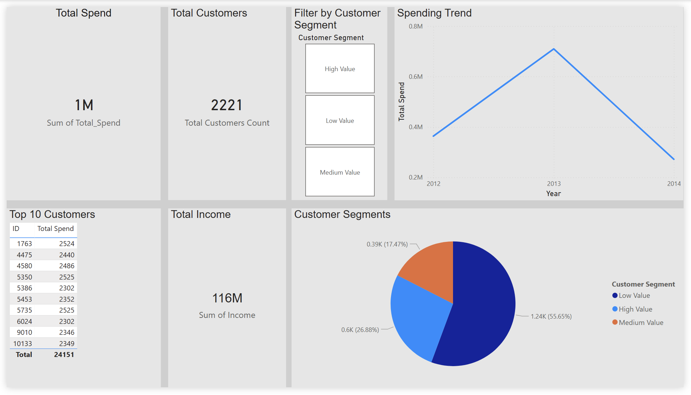

# customer-analytics-dashboard
Power BI dashboard analyzing customer spending and segmentation
Customer Analytics Dashboard

This project analyzes customer spending behavior using Power BI.

<strong>Key Features</strong>
<ul>
  <li>Total customer spending analysis</li>
  <li>Top 10 high-value customers</li>
  <li>Customer segmentation (High, Medium, Low)</li>
  <li>Interactive dashboard with filters</li>
  <li>Total Income</li>
</ul>

<strong>Tools Used</strong>

<ul>
  <li>Power BI</li>
  <li>Excel / CSV dataset</li>
</ul>

<strong>Insights</strong>
<ul>
  <li>Identified high-value customers contributing most revenue</li>
  <li>Segmented customers for targeted strategies</li>
  <li>Visualized spending patterns</li>
</ul>

 <strong>Dashboard Preview</strong>
<ul>

